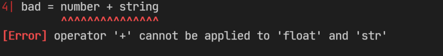

# PyFlow
A type checker for python that is capable of inferring types and performing flow sensitive static analysis.

Here is a basic example that detects a type error before any code is run:

```py
number = 123 + 3.0 / 1.0
string = 'abc'
bad = number + string
```

The above code is obviously incorrect, because we're trying to
add a float and a string, but the Python interpreter won't know that until this chunk of code is executed.
With PyFlow, mistakes like these can be caught easily even before we have any test coverage:

